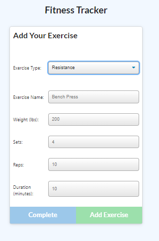
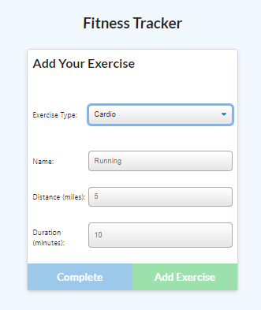

# NoSQL Workout Tracker

## Description

This application is a fitness tracker that tracks daily workouts.  It allows user to log multiple exercises in a workout session on a given day.  User will be able to continue the last workout session, add a new session and track the name, type, weight, set, reps and duration of the exercise.  Using MongoDB aggregate function, total duration of each workout is dynamically add up. User can view their workout on a dashboard that graphs the record with a pie chart, line graph and bar graph. 

## Technology
Back-end: MongoDB, Mongoose, NodeJS and Express.

## Installation
### Steps required running the app through __local server__:

In the terminal mode, user must first run __npm install__ to have its package dependecies. Then, user can run the __server.js__ file in Node environment by running __npm start__. \
Then after sucessfull connection, user need to type _localhost:3000_ in the browser to access index.html. \

### Link to access the app in __Heroku__:

This application is also hosted in Heroku web server. \
Click this link: https://quiet-forest-70187.herokuapp.com/ to access this application.

## Usage 
### __Main Page__: index.html
Using either method, user will be navigated to the main __Fitness Tracker__ page. \
In this page, user can add a new workout or continue on the last workout by clicking the option given. \

### __Adding a new workout__: User can add a new exercise to the tracker. 
In this page, user can add a new exercise from the choice given in the drop down menu.  User can proceed with adding more exercises record or conclude the session by choosing to click the complete option.\
Page preview: \
 \

### __Continue a workout__: User can continue on the last workout with another exercise. 
In this page, user is presented with a choise of exercise to continue from the drop down option.\
Page preview: \

### __Dashboard__: User can view the recorded exercises on the dashboard.
User is presented with a line graph, bar graph and pie charts to visualized the exercises record on a given day. \
Page preview: \

## CONTRIBUTOR
Front-end code is provided by  UW Fullstack Bootcamp Course.

## MAINTAINER 
This is an individual assignment maintained by Carolina Yoedhana.
* GitHub repo: https://github.com/CarolinaYo/fitness-tracker.git
* Deployed Heroku link: https://quiet-forest-70187.herokuapp.com/